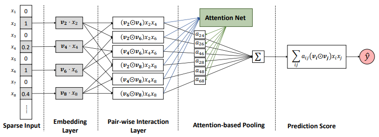

# Attentional Factorization Machines in PyTorch

Unofficial PyTorch implementation of [Attentional Factorization Machines:
Learning the Weight of Feature Interactions via Attention Networks](https://www.comp.nus.edu.sg/~xiangnan/papers/ijcai17-afm.pdf) (github [repo](https://github.com/hexiangnan/attentional_factorization_machine)), as well as [FM](https://www.csie.ntu.edu.tw/~b97053/paper/Rendle2010FM.pdf), on the [MovieLens](https://grouplens.org/datasets/movielens/) dataset.

### To Do
- [ ] models should allow arbitrary number of dense features
- [x] TensorBoard Support 